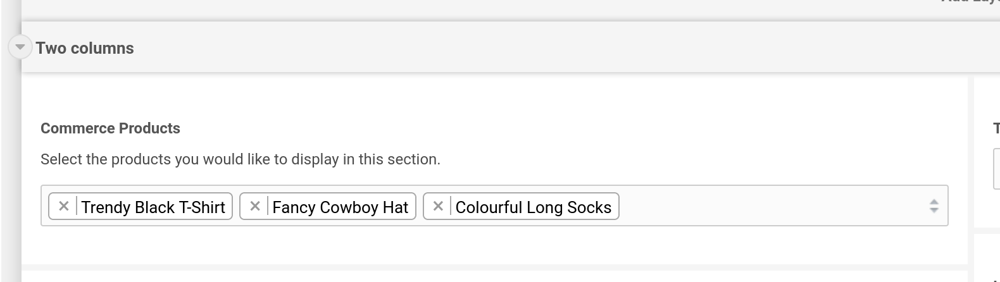
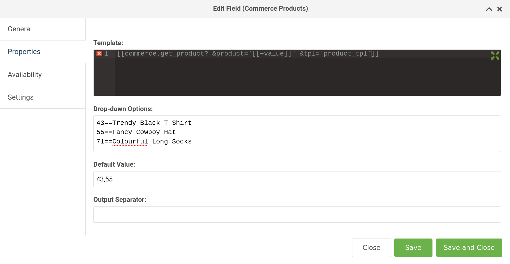
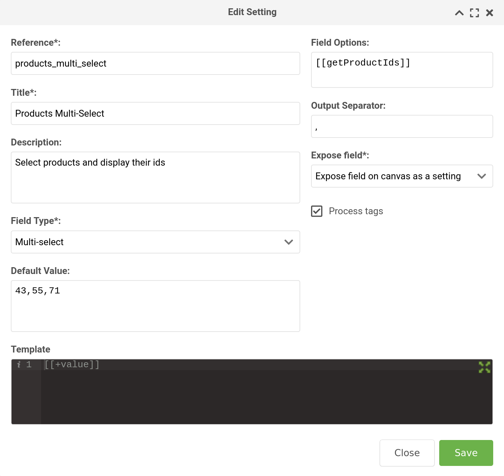

The multi-select input type is an extended version of the dropdown input type. This means that any of the
[dropdown configuration options](https://docs.modmore.com/en/ContentBlocks/v1.x/Input_Types/Dropdown.html) also apply to the multi-select version.

Multi-select settings are also available and function similarly to the select setting, but also include 
configurable templates and output separators.

The difference between the multi-select, and the dropdown input or select setting is... you guessed it... you can 
select more than one value at a time!

- **Key**: multi_select
- **Template Placeholders**: `[[+value]]`
- **Requirements**: ContentBlocks 1.12

## On this page

[TOC]

## Example

  

##Features at a Glance

 - Select multiple values.
 - Available as both an input type and a setting.
 - Includes all the same remote and local configuration options as the [dropdown input type](https://docs.modmore.com/en/ContentBlocks/v1.x/Input_Types/Dropdown.html).
 - Typeahead / search functionality. Type into the multi-select field to filter the options shown in the dropdown.
 - Customisable via a template field, input options, output separator and defaults. 

## Available Properties

### Template

Just like other input types, the template field contains a `[[+value]]` placeholder. The important distinction to note
here is that the template field represents a single value that is selected. So you can add HTML markup here, and it 
will be repeated in the output for each value that is selected by the user. See the Output Separator section below to 
add something between each one.

Normally, leaving the `[[+value]]` placeholder there will be all you need. However, if you're interested in getting a 
bit more complex, have a look at this image:

In the above example, we're hard-coding the product ids and product names in the Drop-down Options field using the `==` syntax,
then in the template, we're calling a [commerce.get_product](https://docs.modmore.com/en/Commerce/v1/Snippets/get_product.html) 
snippet that takes the multi-select `[[+value]]` and parses it through a chunk called `product_tpl`, which contains 
placeholders for all the product values, and HTML markup to display it.

So in this example, it's acting a bit like a [repeater field](https://docs.modmore.com/en/ContentBlocks/v1.x/Input_Types/Repeater.html). 

### Drop-down Options

Specify the options for the multi-select here. You can hardcode the values directly, or use a snippet to dynamically populate 
the values.
See the section _Defining the Options_ on the [dropdown input page](https://docs.modmore.com/en/ContentBlocks/v1.x/Input_Types/Dropdown.html) for details, as it works the same way.

### Output Separator

Perhaps you would like to have the user select multiple resource ids to use in a [`getResources` snippet](https://docs.modx.com/3.x/en/extras/getresources). 
You could add a comma here to separate each id. It doesn't have to be a comma though, it could be any character(s) you like.

### Default Value

A value, which exists in the multi-select options, that should be preselected when the field is added to a page. 
The default value can have multiple values (if they exist) separated by commas.

**Important:** If your default value is **empty**, the multi-select input will not select any values automatically. 

## Multi-Select Setting

The multi-select input is also available as a setting (in a modal, as a field or as normal setting) for both layouts and 
other fields. 

  

As you can see in the image above, the setting also has a template field, an output separator, field options and a default value field.
If you are going to use a snippet in the field options, be sure to check the process tags box.