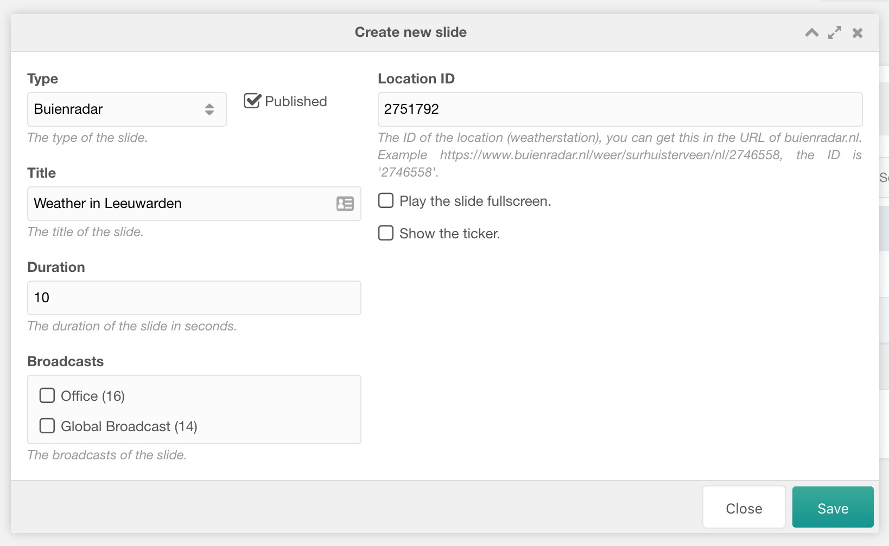

To get started with Digital Signage, you need a license. We offer [free development licenses](https://modmore.com/free-development-licenses/) that you can use to try out Digital Signage, and also for development and staging purposes. [Paid licenses can be found here](https://modmore.com/digitalsignage/pricing/).

[TOC]

## Installing the package

After creating an [api key](https://modmore.com/account/api-keys/) and adding it to your MODX site, you can browse our package provider to download Digital Signage. If you're new to modmore, [learn more about how our package provider works here](https://modmore.com/about/package-provider/).

When you install the package, a few things will be created for you:

- A new Context, called "Digital Signage" (`ds`) which is set to have a base url of `/ds`, meaning your digital signage will be available at `http://yourmodxsite.com/ds/`. 

- A new template, called `Digital Signage (1.1.4-pl original)`, or with a different version number. 

- Several resources in the `ds` context including a home and export resources. You wont have to edit these manually usually.

- A link in the top menu called Digital Signage. This points to the dashboard, which is where you'll manage your slideshows. 

- There are also [permissions](Permissions) that are added on installation; the administrator user group is automatically given these during the installation.

A couple of [settings](Configuration) are also set automatically based on what was created. This includes the context, templates adn more. The standard configuration should be good to start with. 

## Creating your first broadcast

Click on the Digital Signage button in the MODX menu to go to the management dashboard. You'll notice a few tabs:

- **Broadcasts** are your slideshows. They are assigned to players (third tab) and contain slides (second tab). 
- **Slides** (second tab) are the individual pages inside your slideshow. There are different [types of slides](Slide_Types) you can use, as well as custom ones. Depending on the slide type, you can manage the content through this tab.
- **Players** is where you define the different screens you will be showing your broadcasts on. Each screen or device you want to play a broadcast should be a unique player. For each player you can set a schedule.

First, let's create a few slides. 

On the Slides tab, click on **Create new slide**. In the window that opens, select **Default** as the type, check _Published_ and enter a title, content, and how long the slide should be shown. You can also add an image and choose if you want to show the ticker or not. 

Create another slide with type **Buienradar**, which can show the weather. Find a location ID per the shown instructions or use `2751792` for Leeuwarden as an example. Give it a title as well. 

When you have slides, move to the **Broadcasts** tab and click **Create new broadcast**. Enter a name and save. Right click and choose **Update slides (internal slides)**. Drag and drop the slides you created from the right _Available Slides_ to the left _Selected Slides_ column. Close the modal. 

## Connecting a screen (player)

Before we can view the broadcast, we need to connect a screen. On the **Players** tab, create a new player, giving it a nice name and enter a resolution (e.g. `1920x1080`). You can change this later if you don't have a dedicated screen yet. 

Save, and then right click the player in the list and choose **Schedule Player**. Add a schedule entry **Connect Player**. You'll see a link; that's the one you need to open on your player. 

When you open the link on the screen, you can now start managing it from the Digital Signage dashboard. When you change a broadcast or schedule, it will automatically load on your screen within 5 minutes.
