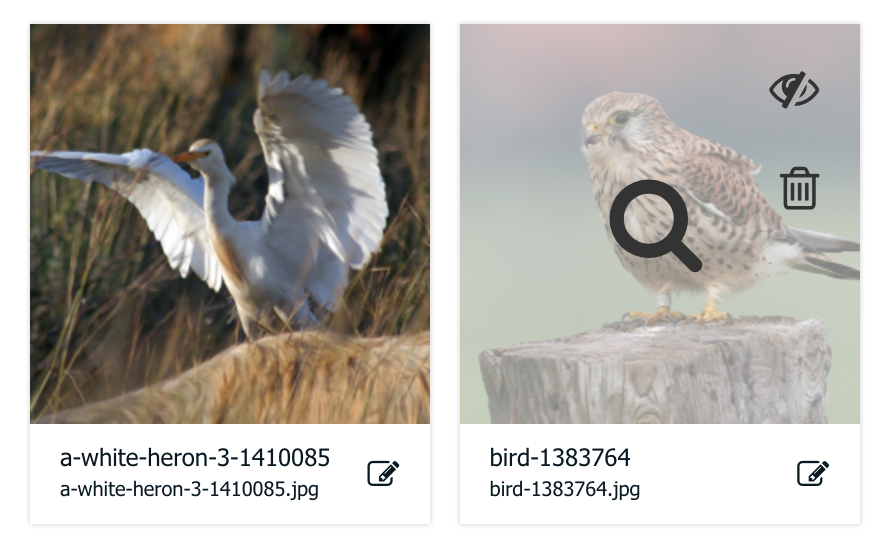

This user guide is meant for the end-users of the MoreGallery add-on. For information about front-end implementation, please review the [documentation](https://modmore.com/moregallery/documentation/).

**Please note** that your designer or developer has the tools to customise MoreGallery to your exact needs. Because of that, not all information in this document may apply to your specific situation. 

MoreGallery is a special type of document that lets you manage image or photo galleries from an easy to use interface. It appears in the Resource tree with an icon representing an image.

[TOC]

## Creating a Gallery

To create a new Gallery, we will first decide where it will sit within the hierarchy of the website. For example, you may want to put it under a "Galleries" or "Photos" menu item that automatically lists the different available galleries for your visitors. In that case, right click the resource or root of the website and choose _Create_ > _Create a Gallery Here_.

If you want it at the root of the website, you can also click the Gallery icon in the toolbar.

In the new page, make sure the right template is selected (your designer or developer should have told you which one) and fill in the details as you would for other pages on the site. Be sure to at least add a title.

Save the new document. You will now be able of adding images to the gallery. Simply scroll to the bottom until you see the Gallery section, and the Upload button.

## Uploading Images

Uploading images is really easy. Just click the Upload button, and choose the image from your computer that you want to add to the gallery. You can choose multiple images at the same time if you hold the _ctrl_ button.

After choosing images, you will see them being added to the images overview. They are still being uploaded (if the images are really big, this can take some time), but when the spinner disappears and the bar turns green, it is done.

## Importing Images

If the images you would like to add to a gallery have already been uploaded to the site, you can use the `Import` button instead of the `Upload` button. The file browser will then open in a window, allowing you to browse and select files on the system. 

## Adding Video

If enabled by your web development partner, you can also add videos to your Gallery. This works for videos hosted on YouTube and Vimeo.

To add a video, click the _Add Video_ button in the toolbar. In the window that pops up you can paste in the link to the video on YouTube or Vimeo. MoreGallery will automatically download the cover image from the video, as well as its name and description. 

## Sorting Images

To sort the images in a different order than what they were uploaded, you can drag them across the page. Click the image while holding down the mouse button, and move your mouse to where you want the image to appear. A black outline will show where the image will be placed if you release the mouse.

## Editing Image Information

Each image has information associated with it. This includes at the very least a name, but may also contain a description, an URL (link) or other data that you can add. 

To edit this information, click the white bar below the image (the one with the name, filename and the modify icon). An edit pane and enlargement of the image will appear below it.

When the edit pane opened, you can edit the information in the fields. When you are done changing the details, you can just close the edit pane with the close button; the changes are automatically saved.

In this window you may also find the ability to tag images and to create crops or thumbnails of the image. 

## Publishing / Hiding and Removing images

When hovering over an image in the main view, you can see a number of options. By clicking on the eye symbol it will hide the image from the gallery, allowing you to bring it back in view with another click. The trashcan icon will remove the image (and its relevant files) completely. Clicking anywhere else on the image will show you a large preview. 

## Viewing large images

To view a large version of an image in the Manager, click the small image preview. A modal window will pop up showing a large version of the image.

