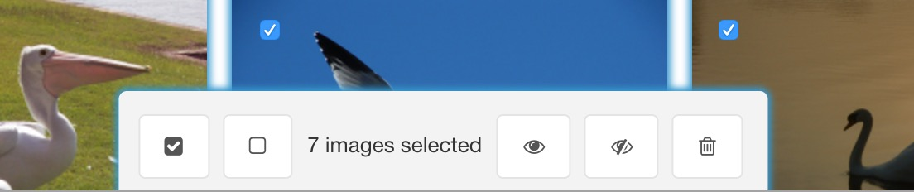

MoreGallery 1.6 introduced batch actions for activating (showing), deactivating (hiding) and removing images in a gallery.

Start by ticking the checkbox shown in the top right of images. This can also be done [from the keyboard](Accessibility) by focusing on the image and hitting `space`. When at least one image is selected, the bulk toolbar will show up at the bottom of your screen which can be focused with `alt`+`b`.

The batch actions toolbar looks like this:

From left to right, these are the provided functions in the toolbar.

- Select all images
- Deselect all images (which also hides the bulk toolbar)
- Mark all selected images as active/visible
- Mark all selected images as inactive/hidden
- Remove all selected images

Keyboard users can tab through these options and execute them with `space`.

Batch actions are processed server-side, followed by an automatic refresh of the gallery. 
