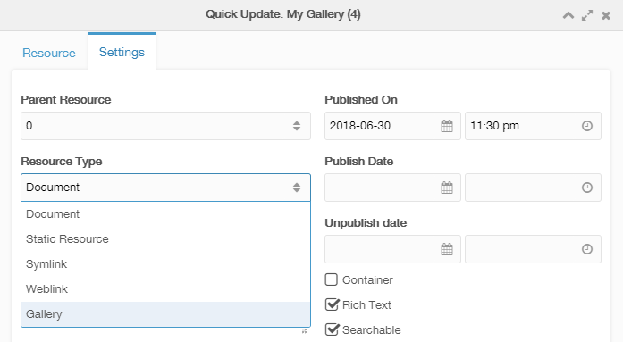

If you would like to add the MoreGallery functionality to an existing resource or document, you will need to change its resource type. While this may sound scary if you haven't done it before, don't worry, it's actually really easy.

Find the Resource you would like to turn into a Gallery. Right click it, and choose the _Quick Update Resource_ option. This will open the Quick Update window.

Open the Settings tab, and find the _Class Key_ option at the bottom of the left row of fields. Click it to see the available options, and choose Gallery. Hit the _Save_ button, and watch how the resource is magically changed to a Gallery.

When you open the resource in normal view by clicking it in the tree, you will see there is now the familiar Gallery functionality. The [User Guide](../User_Guide) contains information on how to use the interface.

The icon of the resource will then change to a gallery icon: 
