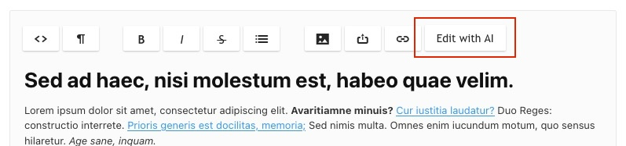
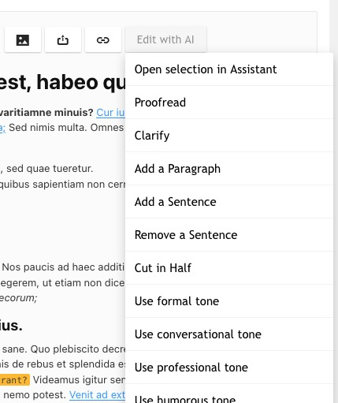

As of Redactor v3.3, we provide a [modAI integration](https://extras.modx.com/package/modai) integration that lets you use various AI Large Language Models to edit or generate content.

To use, add the `modai` button to your toolbar in the Redactor Configurator. Now, highlight the text you wish to edit (or don't to use the full content as context), and click the button to open the modAI Assistant interface.



## Quick Prompts

Optionally, you can configure the **modAI Prompts** at the bottom of the Toolbar tab in the configurator. When configured, these show up as a dropdown menu under the button.



The quick prompts take in the selection, and immediately fire off the configured prompt. This makes it easy to perform repeated actions, add translation options, and so on.

The default value contains a bunch of useful example prompts:

```json
[
    {
        "label": "Proofread",
        "prompt": "Proofread the text and fix any spelling or grammar mistakes"
    },
    {
        "label": "Clarify",
        "prompt": "Improve this copy to eliminate unclear thoughts or awkward phrasing"
    },
    {
        "label": "Add a Paragraph",
        "prompt": "- Add a paragraph to this copy.\n- You can rewrite the other copy if it enhances the copy\n- Format it with HTML markup so it will work in the editor when pasted in."
    },
    {
        "label": "Add a Sentence",
        "prompt": "- Add a sentence to this copy that will improve it\n- You can rewrite the other copy if it enhances the copy\n- Format it with HTML markup so it will work in the editor when pasted in."
    },
    {
        "label": "Remove a Sentence",
        "prompt": "- Remove a sentence from this copy. Format it with HTML markup so it will work in the editor when pasted in."
    },
    {
        "label": "Cut in Half",
        "prompt": "- Condense this copy to roughly half of its current length\n- Maintain important concepts and key topics\n- Combine or eliminate paragraphs if it makes sense and helps with readability\n- Format it with HTML markup so it will work in the editor when pasted in."
    },
    {
        "label": "Use formal tone",
        "prompt": "Rewrite this with a formal tone."
    },
    {
        "label": "Use conversational tone",
        "prompt": "Rewrite this with a casual, conversational tone."
    },
    {
        "label": "Use professional tone",
        "prompt": "Rewrite this with a professional tone."
    },
    {
        "label": "Use humorous tone",
        "prompt": "Rewrite this with a humorous tone."
    },
    {
        "label": "Translate to English (CA)",
        "prompt": "Localise or translate this to Canadian English"
    },
    {
        "label": "Translate to English (UK)",
        "prompt": "Localise or translate this to British English"
    },
    {
        "label": "Translate to English (US)",
        "prompt": "Localize or translate this to American English"
    },
    {
        "label": "Translate to Dutch",
        "prompt": "Translate this to Dutch"
    },
    {
        "label": "Translate to French",
        "prompt": "Translate this to French"
    },
    {
        "label": "Translate to German",
        "prompt": "Translate this to German"
    },
    {
        "label": "Translate to Italian",
        "prompt": "Translate this to Italian"
    },
    {
        "label": "Translate to Japanese",
        "prompt": "Translate this to Japanese"
    },
    {
        "label": "Translate to Korean",
        "prompt": "Translate this to Korean"
    },
    {
        "label": "Translate to Portuguese (BR)",
        "prompt": "Translate this to Brazillian Portugese"
    },
    {
        "label": "Translate to Portuguese (PT)",
        "prompt": "Translate this to European Portugese"
    },
    {
        "label": "Translate to Russian",
        "prompt": "Translate this to Russian"
    },
    {
        "label": "Translate to Spanish",
        "prompt": "Translate this to Spanish"
    }
]
```


