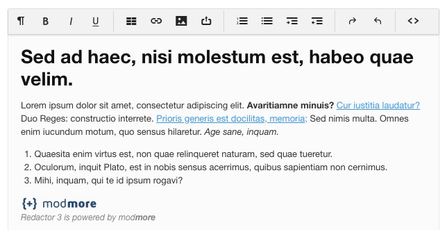
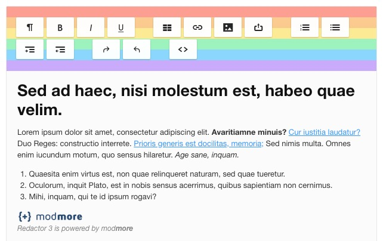

The Redactor editor can be themed with CSS. Most themes only affect the editor and toolbar, but [custom themes can also change the content styling](Custom).
 
On this page, we list the available built-in themes. 

[TOC]

## Standard Themes

### default

The default theme is almost the standard theme from [imperavi](https://imperavi.com/redactor/) with only some minor changes, like adding a background that matches MODX input fields. 

### redactor2

The redactor2 theme mimics the styling from Redactor 2.x. It's not an exact match, but is a lot closer and can help if you're having trouble  adjusting to the new design.

### minimal

The minimal theme provides a flat toolbar without shadows or rounded borders. Taken some inspiration from TinyMCE. 

### dark

The dark theme inverses the color while using a blue for headers and links. 

Note that a dynamic dark mode is also available for most themes; add the `toggledark` button to your toolbar configuration to use it. More on that below.

### pride

Looking to spread some _love is love_? The pride theme splashes a rainbows on your toolbar. (Unicorns are still awaiting delivery.)

### rebeccapurple

A very special shade of purple indeed, [rebeccapurple exists in memory of Eric Meyer's daughter](https://meyerweb.com/eric/thoughts/2014/06/19/rebeccapurple/).

## Dark Mode

Aside from the Dark theme, shown before, you can also use a dynamic dark mode. This functions as a toggle button in the toolbar, and switches to a dark version of the chosen theme. 

To use it, add `toggledark` to your Toolbar Buttons in the configurator. Then find the toggle button in the toolbar.

The dark mode works best with the `default`, `redactor2` and `minimal` themes. Shown below is the toggling in action with the redactor2 theme.

<video width="500" height="163" autoplay="autoplay" muted loop playsinline poster="../images/darkmode.jpg" src="../images/darkmode.mp4" type="video/mp4">

</video>

When toggling the default theme, that switches to the dark theme. The other themes have their own dark styles which may be slightly different.

Toggling the dark theme does not have any effect.

## Custom themes

[Learn more about custom themes](Custom).
