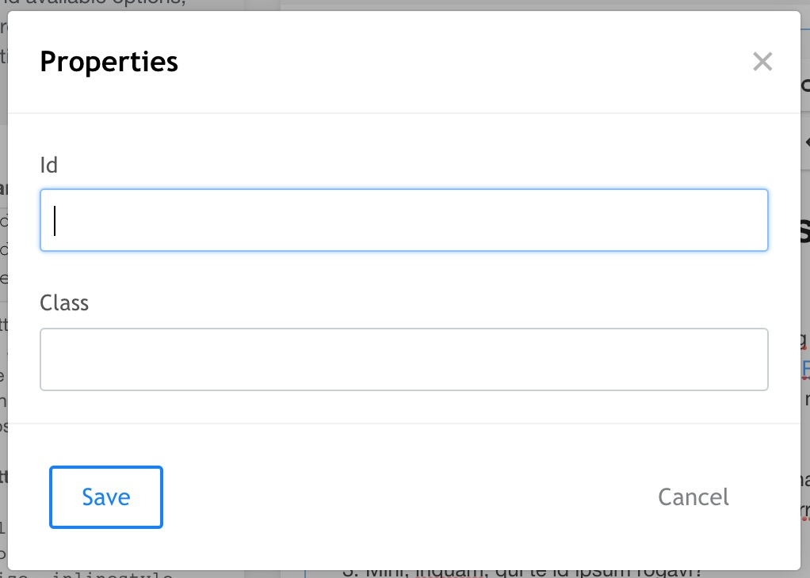

New in Redactor 3 is the properties plugin. It allows you to add a class or ID to any block element. 

They're simple text inputs, requiring the user to enter the appropriate values. For more restricted adding of classes or IDs, use [custom formatting](Custom_Formatting). 