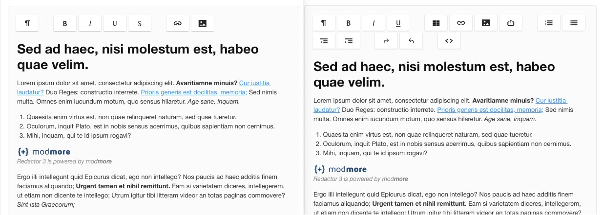

The toolbar is the most important aspect of Redactor, providing you with the buttons to add markup and media. 

It is primarily configured by the list of buttons, in the Toolbar section of the configurator. The available list of buttons is shown below that field.

[TOC]

## Buttons

- Formatting and text: format (includes [custom formatting](Custom_Formatting)), bold, italic, deleted, underline, sup, sub, fontcolor, fontfamily, fontsize, [inlinestyle](Inline_Styles), textdirection, alignment 
- Lists: lists, ol, ul, indent, outdent 
- Media: link, image, file, video, widget 
- Editor: redo, undo, fullscreen, [divider](Dividers)
- Others: [html](Source), line, [properties](Properties), specialchars, table

## Redactor Plugins

Whenever a toolbar button requires a Redactor plugin, it is automatically initialised. 

In some cases, the positioning of the plugin cannot be changed. This has to do with how plugins are initialised one at a time, and that buttons added to the toolbar are added either at the end or relative to specific buttons.

The following plugins have hardcoded positions in the toolbar which cannot be changed:

- inlinestyle, always added after the format button
- table, always added before the link button
- video, always added after the image button

The following plugins are added to the end of the toolbar:

- alignment
- clips
- fontcolor
- fontfamily
- fontsize
- fullscreen
- properties
- specialchars
- textdirection
- variable
- widget

## Examples

Redactor ships with a Minimal and Standard configuration out of the box. These use the following button configuration.

Minimal: 

> format, divider, bold, italic, underline, deleted, divider, link, image

Standard: 

> format, bold, italic, underline, divider, table, link, image, file, divider, ol, ul, indent, outdent, divider, redo, undo, divider, html

