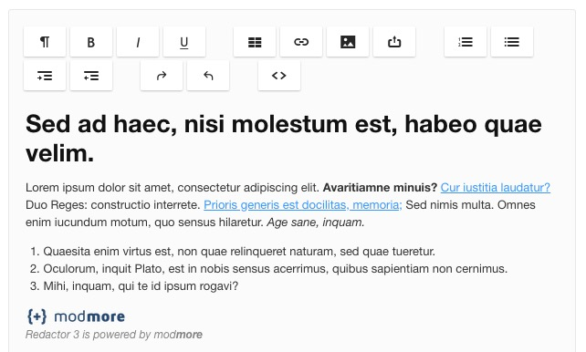
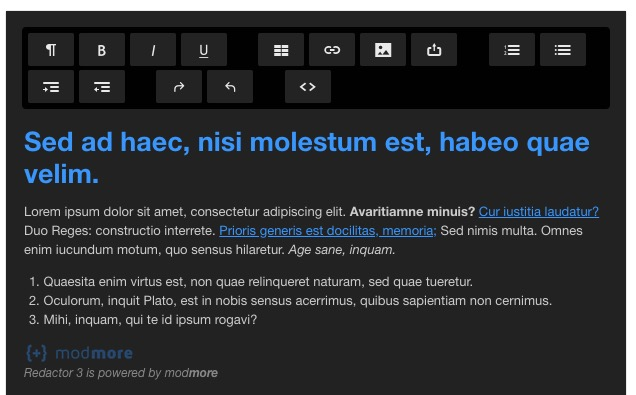

The Redactor editor can be themed with CSS. Most themes only affect the editor and toolbar, but [custom themes can also change the content styling](Custom).
 
On this page, we list the available built-in themes. 

[TOC]

## default

The default theme is almost the standard theme from [imperavi](https://imperavi.com/redactor/) with only some minor changes, like adding a background that matches MODX input fields. 

## redactor2

The redactor2 theme mimics the styling from Redactor 2.x. It's not an exact match, but is a lot closer and can help if you're having trouble  adjusting to the new design.

## dark

The dark theme inverses the color while using a blue for headers and links. 

## pride

Looking to spread some _love is love_? The pride theme splashes a rainbows on your toolbar. (Unicorns are still awaiting delivery.)

## rebeccapurple

A very special shade of purple indeed, [rebeccapurple exists in memory of Eric Meyer's daughter](https://meyerweb.com/eric/thoughts/2014/06/19/rebeccapurple/).

