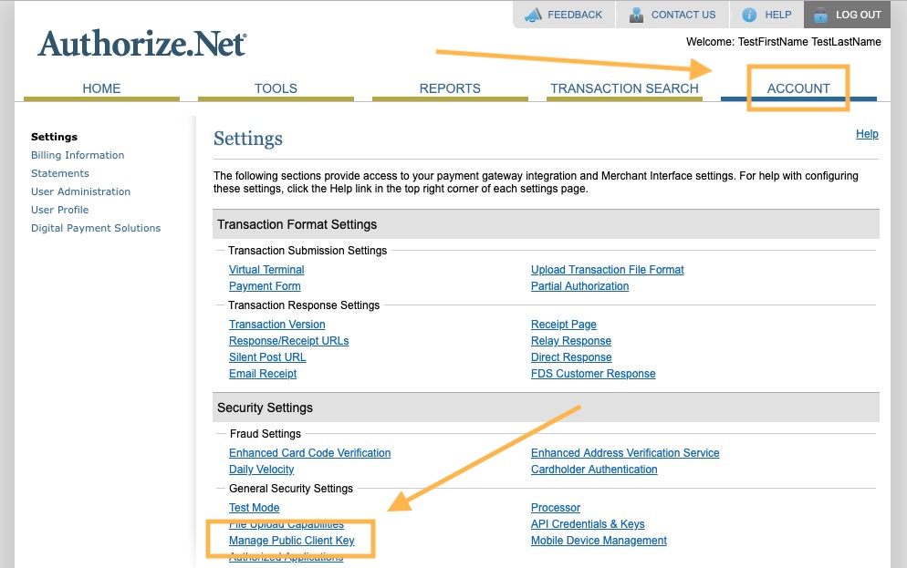
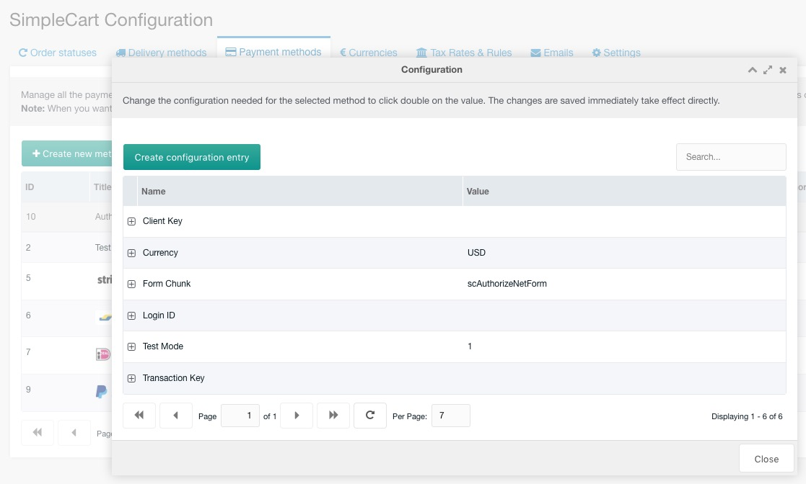
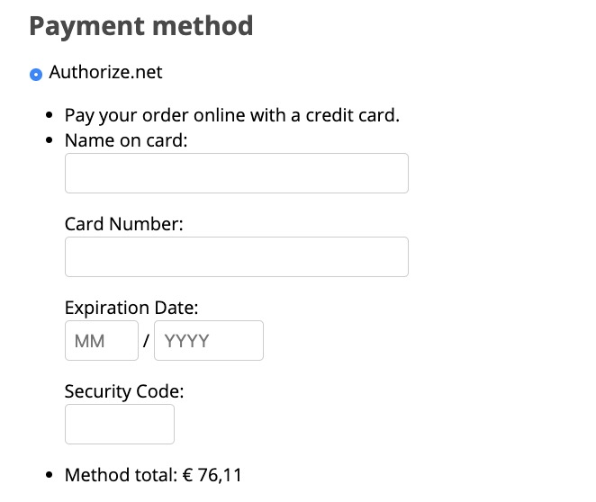

The Authorize.net Gateway for SimpleCart is free to install from the modmore.com package provider. Its source code can be found on [GitHub](https://github.com/modmore/SimpleCart_Authorize.Net) and development was sponsored by Roger Sullivan, Founder of [Snow Day Code](http://snowdaycode.com/). Thanks, Roger!

After installing the gateway, it will show up in the Payment Methods tab in the SimpleCart > Administer component.

> **Important: version 1.x of the gateway stopped working in July 2019. You should upgrade to version 2 if you haven't yet.**

[TOC]

## Upgrading from v1.x

In v1.x of the gateway, the customer was redirected off-site to a hosted payment page ("SIM" integration). In v2, the customer stays on-site and enters their credit card information on the payment page ("Accept.js" integration).

v1 of the gateway is no longer functional due to the MD5 hash deprecation. 

If you're upgrading from v1, you'll need to update your payment gateway configuration to accept payments.

Most importantly, you'll need to enter the **Client Key**. Find it in your Authorize.net dashboard under Account > Settings > Security Settings > General Security Settings > Manage Client Key.

Copy the client key, go to Extras > SimpleCart > Administer and click on the cog icon for the Authorize.net gateway. Enter the client key in the appropriate property there.

You'll also want to make sure the design meets your needs. A basic design is included in the standard SimpleCart CSS, but you can customise it as detailed below.

## Managing Gateway Configuration

To manage the properties for Authorize.net, simply hit the Cog icon next to the name, or right click the row in the grid and choose Configuration.

Here's what each of the properties are for:

- **Client Key**: the public key, used for the front-end Accept.js implementation. Find it in the Authorize.net Merchant Dashboard (or Sandbox) at Account > Settings > Security Settings > General Security Settings > Manage Public Client Key.
- **Currency**: the 3-character code for the currency you're using. This should match your SimpleCart configuration.
- **Form Chunk**: name of the chunk to use for rendering the client-side payment form. See the section on customisation below.
- **Login ID**: the ID for your merchant account (or sandbox account). This is provided during signup, and can also be found under Account > Security Settings > General Security Settings > API Credentials & Keys.
- **Test Mode**: set to 1 to use the sandbox, or 0 to use the live Authorize.net environment. (Note: transactions do no show up in the sandbox currently, because the payments are marked as being test requests.)
- **Transaction Key**: found at the same place as the Login ID, the Transaction Key is used for server-side authentication and validation.

## Changing the Title, Description and Price

To manage the title, description and transaction fee for the Authorize.net gateway, you right click the gateway in the list and choose _Update Method_. In the popup, you can then edit those values.

The name cannot be changed, as that is tied in with loading and identifying the gateway. The title is what is shown to the customer in the checkout.

These values are persisted to the lexicon. On the top-right of the payment methods grid, you can choose the language. Select the language before opening the method update window.

## Customising the payment form

If you're looking to make the payment form prettier, you can get quite far just by implementing your own CSS. It's recommended to use the browser development tools to inspect the exact markup, available classes, and current style inheritance to identify how to best approach your tweaks.

SimpleCart v2.6.2+ includes generic styling for the payment form that should make it look at least decent if you enable the default CSS.

If you want to go beyond just styling, you can also set a custom **Form Chunk** in the gateway properties. Set it to the name of a new chunk, that you base off the default `scAuthorizeNetForm` chunk. The `scAuthorizeNetForm` chunk is overwritten on upgrade and should not be edited directly.

Note that if you go this route, you should make sure with every update of the gateway that it still works as expected. In rare cases, you may need to incorporate some changes into your own chunk.
