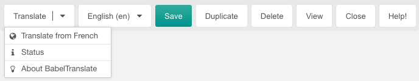
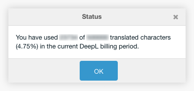

After installation, a MODX resource contains a new Translate button. This button
opens a menu for translating the resource.

The first section of the menu contains (if available) all linked babel contexts
and provides a translation from the context language.

The second section of the menu contains a menu entry, that shows the usage status of the DeepL API.

