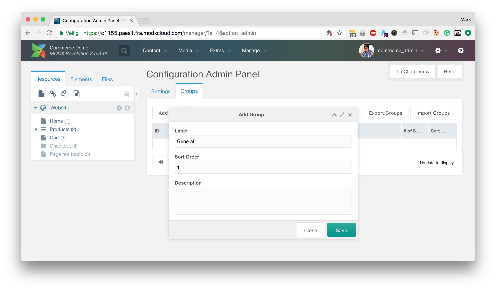
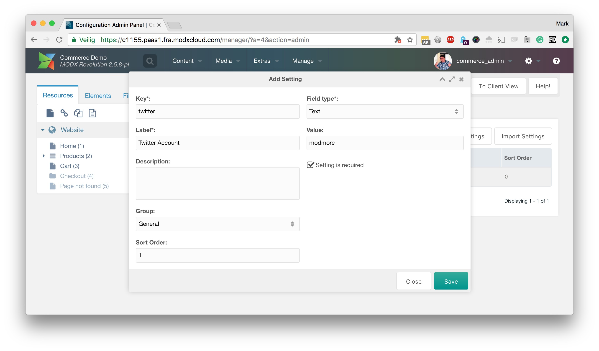
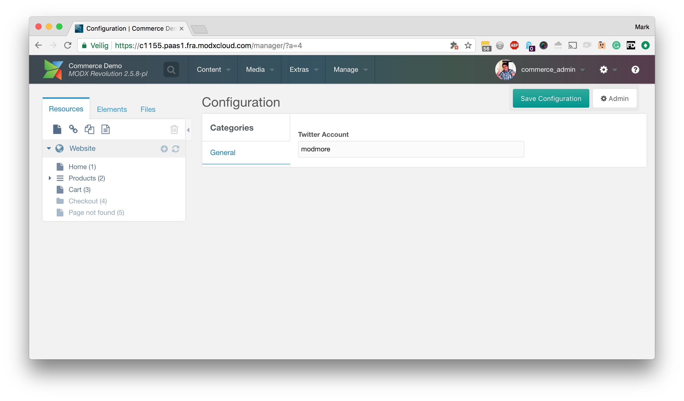

Welcome to a new, user-friendly, way of letting your client manage settings.

During the installation, you'll be asked if you want to use ClientConfig in global mode, or in context-aware mode. To learn more about context-aware mode, see [Multiple Contexts](Multiple_Contexts).

[TOC]

## Creating a Group

With ClientConfig you can let client manage system-wide settings easily. But you'll have to set up the settings first.

After the installation, go to Extras > Configuration. You should see a message stating to check this documentation.

Click the Admin button in the top right. This button is only available if you are part of the Administrator user group, or a groups that is added to the `clientconfig.admin_groups` system setting.

In the Admin panel, you will find two tabs. Settings and Groups.

First open the Groups tab and hit the button to create a new group. Give it a label, for example _General_ or _My first group_, and an optional description. Save the group.

## Creating a Setting

Now we can add some settings, in the Settings tab. 

Click the _Add Setting_ button and fill out the form. 

Here's a run-down of each field and what they can do. Note that some fields are only visible when you used a certain field type.

| Field | Description |
|---|---|
| **Key** | The key reference for this setting. If you set this to `twitter`, you can reference its value throughout the website as `[[++twitter]]` |
| **Label** | The name of the setting as displayed to the user. For example you might set this to Twitter Account. |
| **Description** | An optional longer description that will be displayed to the user when hovering over a field in the component. |
| **Group** | Allows you to categorise settings into different groups. These groups are translated into tabs in the component. |
| **Sort Order** | Allows you to decide the order in which settings are displayed to the user. |
| **Field type** | Decides how the field is displayed and what it can do. There are many different options for you to choose from, which [you can find listed here](Field_Types). |
| **Value** | Allows you to set the system/global value. This gets updated from the client view. |
| **Source** | Only available for the file or image type, this allows you to specify the media source to use for selecting the file or image. |
| **Field options** | Only available for the Selectbox field type, this allows you to specify options for in the drop down. [See the Field Types documentation](Field_Types). |
| **Process tags in options** | Only available for the select field type. When checked, chunk and snippet tags in the field options will be executed before creating the dropdown. |
| **Setting is required** | When enabled, the user cannot save the settings unless this field has a value. |

## Client view

After having added a few settings, click the To Client View button in the top right to get to the interface that your client will manage settings with. 

You will see the settings are in the tabs you defined, and super easy for your client to maintain.

You can go back to the admin area any time to add more groups and settings. 

If you'd like different values per context, [continue reading here](Multiple_Contexts).

