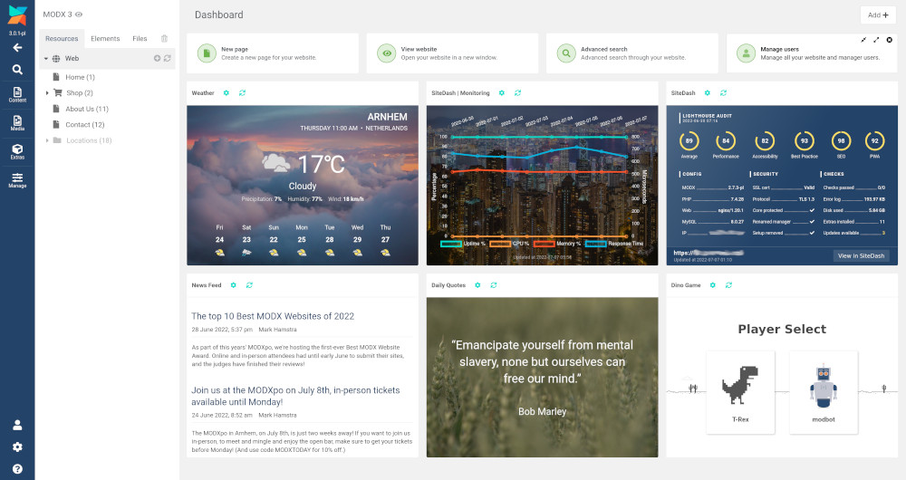
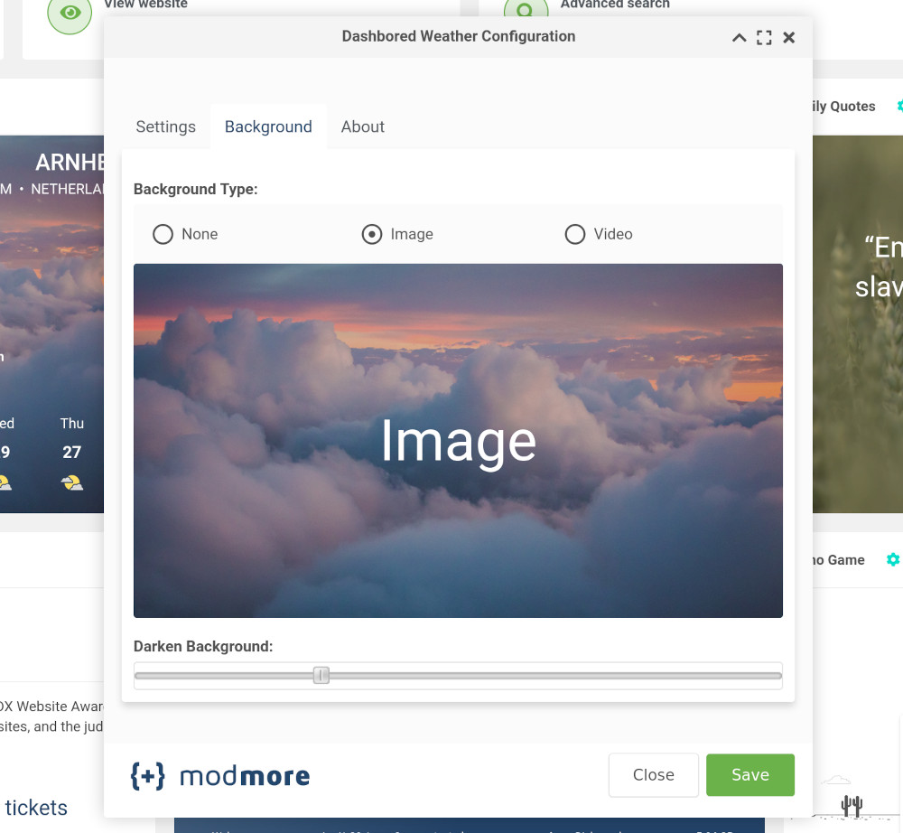

Dashbored is a collection of dashboard widgets for MODX 3.0+

Widgets included:

* Weather
* Daily Quotes
* News Feed
* Dino Game
* SiteDash
* SiteDash | Extended Monitoring

_The image above shows the six different kinds of widgets available. Some are using custom backgrounds, and some are the default._

[TOC]

## Getting Started

Install Dashbored via the [modmore package provider](https://modmore.com/about/package-provider/). Then go to your MODX dashboard, and click on the **Add** button to select the widgets you would like to use.

## SiteDash Widgets

There are two widgets that utilise your SiteDash account, enabling you to display both website audit and extended monitoring data. 

For these you will need to add your SiteDash Integration Key to the `dashbored.sitedash site_integration_key` system setting. You can generate a **SiteDash Integration Key** by logging into [SiteDash](https://sitedash.app/), select the site you would like to use, click on _Manage & Actions_, and you'll find it halfway down the page.

## Settings

Clicking on the cog icon in the widget title bar will open the settings window for that particular widget. What settings are available differ with widget but generally there will be a `Settings` tab, a `Background` tab and an `About` tab (except for the Dino Game widget which also has a `High Scores` tab).

The settings tab will have fields to configure the data for that widget, for example the weather widget allows for changing the location, the temperature format, and distance measurements.

The background tab lets you choose between using the default background, an image, and a video. Hover over the image box and a `Select image` button will appear. You can then click it to open the MODX file browser. There is also a slider control to darken the image or video background so that the text can still easily be seen over the top.

Configuration data for each widget is stored as user settings. So, each user can set up their widgets according to their own taste.

The About tab contains information about the API, service, or GitHub repository that widget uses.

## Refreshing the widget

Data from the widgets is cached for an amount of time, so each time you return to the dashbored, you don't need to wait for responses from the various APIs. If you would like to refresh the widget without waiting, click on the refresh icon in the widget's title bar.

